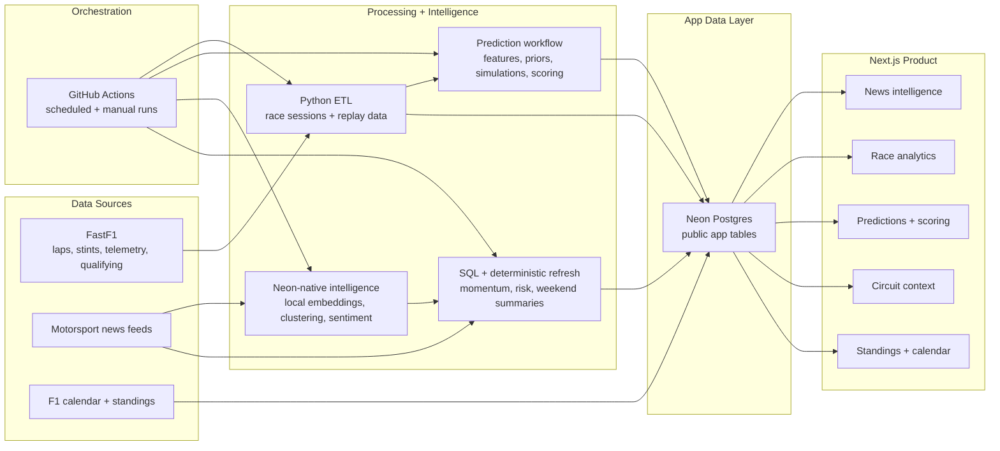

# F1 Bulletin

F1 Bulletin is a Formula 1 data product that combines race analytics, news intelligence, circuit context, standings, and prediction workflows in one race-weekend dashboard.

## Background

The project began as an exploration of FastF1 data after watching *Drive to Survive*. It started with a small Python and Streamlit app for lap analysis, strategy, sector times, and circuit replay.

I later rebuilt it around a broader question: what would it look like to connect race data, F1 news, model predictions, and circuit-specific context in one product? Snowflake became the data engineering layer for the news intelligence work, while Next.js became the public interface.

## What It Does

- Groups similar F1 stories across sources
- Tracks driver and constructor sentiment from article text
- Produces race predictions with Bayesian priors, current-season weighting, and Monte Carlo simulations
- Shows lap pace, tyre strategy, sector times, and race analytics
- Adds circuit-specific context for each race weekend
- Displays standings and calendar views

## Architecture

## Methods and Design Choices

**Incremental intelligence flow**

GitHub Actions generates embeddings locally with a compact ONNX model. Neon stores half-precision vectors and performs bounded incremental enrichment for semantic topics, sentiment, momentum, regulatory risk, session chatter, and pre-race summaries. The job skips unchanged articles, retains vectors for 180 days, and stops adding vectors at a 400 MB database guard. Snowflake remains an optional enrichment path, but the public product no longer depends on it.

**Current-season weighting**

The prediction workflow starts with historical priors, then increases the weight of current-season race evidence as more results become available. This keeps early-season predictions anchored while allowing the model to adapt as the season develops.

**Simulation over single-point ranking**

Instead of only ranking drivers from P1 to P20, the prediction workflow uses simulations to produce probabilities. That makes the output more useful because a driver can be ranked second while still having a very different win or podium probability from another driver nearby.

**Scored predictions**

Predictions are scored after actual race results are available. The workflow tracks position error, podium hits, winner accuracy, and probability quality, creating a feedback loop for model evaluation.

**Circuit-specific context**

The circuit layer exists because track characteristics change how form should be interpreted. A good prediction page should know the difference between a high-degradation race, a street circuit, a low-overtaking track, and a power-sensitive layout.

## What Makes It Different

Most F1 dashboards show results, standings, or news in isolation. I wanted F1 Bulletin to connect those layers: what happened on track, what the model expected, what the circuit tends to reward, and what the news cycle is emphasizing.

## Data Sources

The project combines public race/session data, public F1 calendar and standings data, and motorsport news sources. FastF1 is used for session-level race analytics, while news and standings data are processed into app-ready views.

## Tech Stack

Python, FastF1, FastEmbed, pgvector, Neon Postgres, Snowflake (optional), Next.js, React, TypeScript, Vercel

## Note

This is an independent fan project and is not affiliated with Formula 1.
