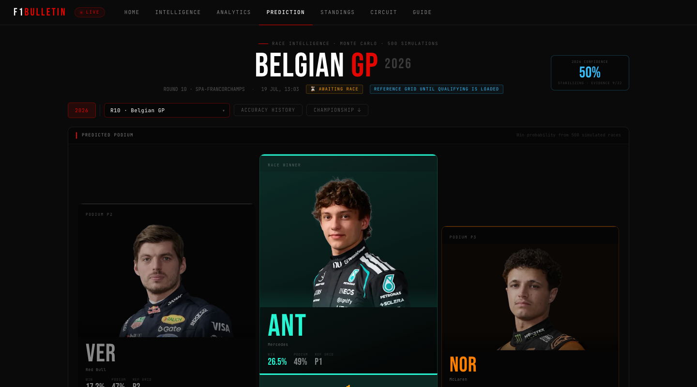
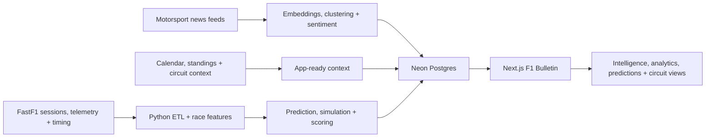

# F1 Bulletin

> **The timing screen tells you who was fastest. F1 Bulletin connects the pace, strategy, circuit, news, and probabilities that explain why—and asks what comes next.**

  

  <strong>Race analytics · News intelligence · Circuit context · Probabilistic predictions</strong> 
  <a href="https://f1bulletin.pournamiprakash.dev"><strong>Enter the live dashboard →</strong></a>

F1 Bulletin is a race-weekend intelligence product that brings Formula 1 data and narrative into the same view. It connects what happened on track, what the model expected, what the circuit tends to reward, and what the news cycle is emphasizing.

## Start With a Question

- Who has genuine race pace—and who only looks quick on one lap?
- How much should current form matter at this particular circuit?
- What are tyre strategy and sector performance revealing that the result hides?
- Is the paddock narrative supported by what is happening on track?
- When the prediction was wrong, **how wrong was it?**

Those answers usually live across timing data, standings, race reports, circuit guides, and prediction pages. F1 Bulletin connects them so every signal adds context to the others.

## Why It Matters

A Formula 1 weekend creates more information than a finishing order can explain. The same result can come from raw pace, tyre degradation, track position, circuit characteristics, weather, reliability, or strategy—and each factor changes what the next race might look like.

F1 Bulletin turns those fragments into a connected race story. Lap pace can be read alongside tyre strategy, predictions can be interpreted against circuit demands, and news momentum can be compared with current performance.

The prediction workflow is accountable after the chequered flag. Position error, podium hits, winner accuracy, and probability quality remain visible, so forecasts are evaluated rather than presented as unsupported certainty.

## Choose Your Lens

| Enter through | What you can explore |
|---|---|
| **Intelligence** | Story clusters, driver and constructor sentiment, momentum, risk, and race-weekend signals |
| **Race Analytics** | Lap pace, tyre stints, sectors, sessions, replay data, and driver-level performance |
| **Predictions** | Predicted order, win and podium probabilities, confidence, and completed-race scoring |
| **Circuit Room** | Track character, tyre demand, overtaking difficulty, historical context, and venue specialists |
| **Drivers** | Performance profiles, sentiment, trends, results, and season context |
| **Standings + Calendar** | Championship position, constructor progress, race schedule, and weekend status |
| **Guide** | A clear route into Formula 1 formats, flags, tyres, strategy, points, and terminology |

## How the Prediction Earns Trust

### It adapts as the season develops

Historical priors anchor the model when current-season evidence is limited. As more races are completed, recent performance receives more weight and the model becomes increasingly season-specific.

### It produces probabilities, not false certainty

Monte Carlo simulation estimates win, podium, and finishing-position probabilities instead of stopping at a P1-to-P20 list. Two neighboring drivers can have very different risk profiles even when their predicted positions look similar.

### It understands that circuits change the question

Street circuits, high-degradation races, power-sensitive layouts, and low-overtaking tracks reward different strengths. Circuit context changes how team and driver form should be interpreted.

### It keeps the result in the loop

After actual results arrive, the workflow scores position error, podium calls, winner accuracy, and probability quality. Each race becomes evidence for evaluating the next prediction.

## How News Becomes Intelligence

F1 Bulletin groups related stories across motorsport sources, generates local embeddings with a compact ONNX model, and enriches the news layer with semantic topics, sentiment, momentum, regulatory risk, session chatter, and pre-race summaries.

The flow is incremental by design: unchanged articles are skipped, vectors are retained for a bounded period, and storage growth is guarded. Snowflake remains available as an optional enrichment path, but the public product runs on the Neon-native intelligence layer.

## From Track to Product

```mermaid
flowchart LR
    A["FastF1 sessions, telemetry + timing"] --> D["Python ETL + race features"]
    B["Motorsport news feeds"] --> E["Embeddings, clustering + sentiment"]
    C["Calendar, standings + circuit context"] --> F["App-ready context"]
    D --> G["Prediction, simulation + scoring"]
    E --> H["Neon Postgres"]
    F --> H
    G --> H
    H --> I["Next.js F1 Bulletin"]
    I --> J["Intelligence, analytics, predictions + circuit views"]
```

GitHub Actions orchestrates ingestion, intelligence refreshes, session loading, prediction generation, and post-race scoring. Heavy processing stays in Python and SQL; the public Next.js product reads compact, app-ready data from Neon.

## Data Foundation

The project combines public Formula 1 session data, timing and telemetry, calendar and standings feeds, circuit context, motorsport news sources, and generated prediction artifacts. FastF1 supports session-level analytics, while the remaining sources are processed into product-ready intelligence and context views.

## Built With

- **Product:** Next.js, React, TypeScript, Framer Motion, Vercel
- **Data and modeling:** Python, FastF1, FastEmbed, pgvector, Neon Postgres
- **Orchestration and enrichment:** GitHub Actions, SQL, Snowflake (optional)

## Origin

The project began as a small FastF1 and Streamlit experiment for lap pace, strategy, sector times, and circuit replay. It grew around a broader product question: what would it look like to connect race data, news, model predictions, and circuit-specific context instead of presenting each one in isolation?

F1 Bulletin is the answer I built: one place to understand what happened, why it mattered, and what the evidence suggests comes next.

## Disclaimer

F1 Bulletin is an independent fan project. It is not affiliated with, endorsed by, or associated with Formula 1, Formula One Management, the FIA, or any Formula 1 team. Names and marks belong to their respective owners.
