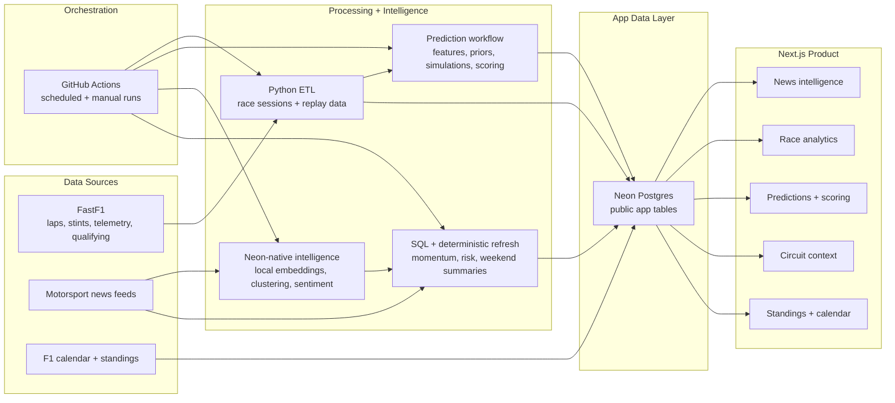

# F1 Bulletin

[**View the live dashboard**](https://f1bulletin.pournamiprakash.dev)

F1 Bulletin brings race analytics, news intelligence, circuit context, standings, and probabilistic predictions into one Formula 1 race-weekend dashboard.

## Background

The project began as a small FastF1 and Streamlit experiment for exploring lap pace, strategy, sector times, and circuit replays. It later grew around a broader question: what would it look like to connect race data, F1 news, model predictions, and circuit-specific context in one product?

The current version uses Next.js for the public experience and Neon Postgres for the application data layer. Snowflake, which supported an earlier stage of the news-intelligence pipeline, remains available as an optional enrichment path.

## Highlights

- Groups related stories across motorsport news sources
- Tracks driver and constructor sentiment from article text
- Produces race predictions using historical priors, current-season evidence, and Monte Carlo simulation
- Explores lap pace, tyre strategy, sector times, and race sessions
- Adds circuit characteristics and historical context to each weekend
- Brings predictions, results, standings, and the race calendar into one interface

## Architecture

```mermaid
flowchart LR
  subgraph Sources["Data Sources"]
    A["FastF1<br/>laps, stints, telemetry, qualifying"]
    B["Motorsport news feeds"]
    C["F1 calendar + standings"]
  end

  subgraph Orchestration["Orchestration"]
    D["GitHub Actions<br/>scheduled + manual runs"]
  end

  subgraph Processing["Processing + Intelligence"]
    E["Python ETL<br/>race sessions + replay data"]
    F["Prediction workflow<br/>features, priors, simulations, scoring"]
    G["Neon-native intelligence<br/>local embeddings, clustering, sentiment"]
    H["SQL + deterministic refresh<br/>momentum, risk, weekend summaries"]
  end

  subgraph AppData["App Data Layer"]
    I["Neon Postgres<br/>public app tables"]
  end

  subgraph Product["Next.js Product"]
    J["News intelligence"]
    K["Race analytics"]
    L["Predictions + scoring"]
    M["Circuit context"]
    N["Standings + calendar"]
  end

  D --> E
  D --> F
  D --> G
  D --> H
  B --> G
  B --> H
  A --> E
  E --> F
  E --> I
  F --> I
  G --> H
  H --> I
  C --> I
  I --> J
  I --> K
  I --> L
  I --> M
  I --> N
```

## Model and Data Design

### Incremental intelligence

GitHub Actions generates embeddings with a compact ONNX model. Neon stores half-precision vectors and supports bounded, incremental enrichment for semantic topics, sentiment, momentum, regulatory risk, session chatter, and pre-race summaries. The workflow skips unchanged articles, retains vectors for 180 days, and stops adding vectors at a 400 MB database guard.

### Adaptive season weighting

The prediction workflow begins with historical priors, then gives current-season evidence more weight as results accumulate. This anchors early-season predictions while allowing the model to adapt as the year develops.

### Probabilities, not just rankings

Monte Carlo simulations produce win, podium, and finishing-position probabilities rather than only a P1-to-P20 ranking. Predictions are scored after each race using position error, podium hits, winner accuracy, and probability quality.

### Circuit-aware context

Track characteristics change how form should be interpreted. The circuit layer distinguishes factors such as tyre degradation, overtaking difficulty, street-circuit behavior, and power sensitivity.

## Why It Matters

Following a Formula 1 weekend often means piecing together results, timing data, standings, circuit characteristics, predictions, and news from separate sources. That makes it difficult to see how the story around a race connects to what is happening on track.

F1 Bulletin brings those signals together so each one adds context to the others: lap pace can be read alongside tyre strategy, predictions can be interpreted against circuit characteristics, and news trends can be compared with current performance. The result is a clearer view of not only what happened, but why it may have happened and what could happen next.

The prediction workflow is also evaluated after each race. Tracking position error, podium hits, winner accuracy, and probability quality makes the model's performance visible instead of presenting predictions as unsupported certainty.

## Data Sources

The project combines public race-session data, calendar and standings data, and motorsport news feeds. FastF1 supports session-level analytics; other sources are processed into app-ready news, context, and standings views.

## Tech Stack

- **Frontend:** Next.js, React, TypeScript, Framer Motion, Vercel
- **Data and modeling:** Python, FastF1, FastEmbed, pgvector, Neon Postgres
- **Orchestration and enrichment:** GitHub Actions, SQL, Snowflake (optional)

## Disclaimer

F1 Bulletin is an independent fan project. It is not affiliated with, endorsed by, or associated with Formula 1, the FIA, or any Formula 1 team.
